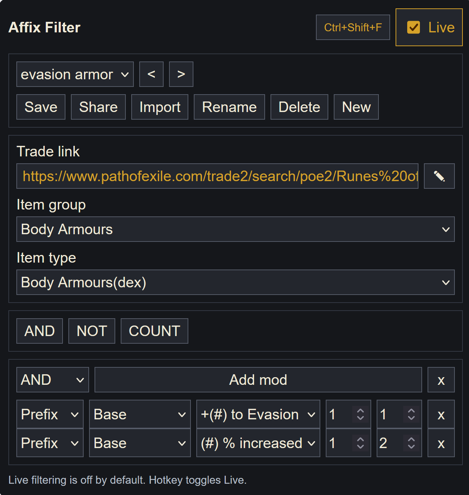
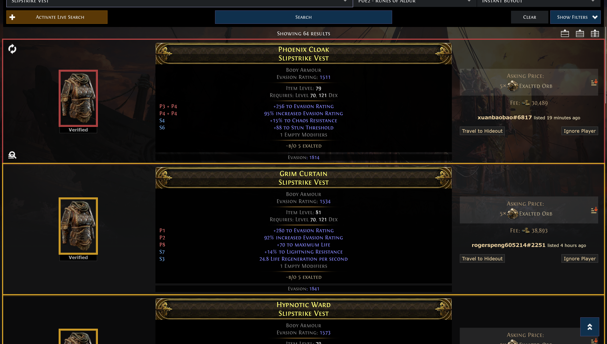

# POE2 Trade Affix Filter

Firefox WebExtension for highlighting Path of Exile 2 trade results by explicit affix names and tier ranges.

The official trade site can filter aggregate stat values, but hybrid explicit modifiers can combine multiple affixes into one displayed stat. This extension reads the explicit affix names shown on each trade result, evaluates user rules against a bundled PoE2DB affix snapshot, and marks results directly on the trade page.

## Install In Firefox

1. Open `about:debugging#/runtime/this-firefox`.
2. Click `Load Temporary Add-on`.
3. Select this repository's `manifest.json`.
4. Add or pin `POE2 Affix Filter` to the toolbar if Firefox does not show it automatically.
5. Open a `https://www.pathofexile.com/trade2/...` search page.

Temporary add-ons are removed when Firefox restarts. Load the manifest again after a restart.

## Usage

Click the toolbar icon to open the filter UI.



- Choose an item group and item type from the bundled PoE2DB modifier navigation.
- Paste a related trade link into the `Trade link` field. Empty trade links start in edit mode; saved valid Path of Exile 2 trade links become clickable.
- Add one or more top-level groups.
- Add mod rules inside each group.
- Pick prefix/suffix, mod family, and inclusive min/max tier for each rule.
- Toggle `Live` to turn the filter on or off. When Live is on, the current results are filtered and the trade page keeps filtering as results change.
- The hotkey hint at the top of the popup shows the current Live shortcut. Click it to open Firefox's extension shortcut settings and edit the hotkey.
- Selecting a saved profile in the dropdown loads it immediately.
- Use `New` to start a blank unsaved profile. It will not appear in the profile dropdown until you save it, and the in-progress filter remains stored while the popup is closed.
- `Save` updates the selected saved profile immediately. When working on a new unsaved profile, it asks for a profile name inside the popup.
- Use `Share` to copy the current profile, trade link, and mod configuration to the clipboard. Use `Import` to paste a shared profile string, save it, select it, and load it.

`Live` keeps the active rules running: while it is on, current entries and every entry added by live search or by loading more results are evaluated once and shown with a border result.



Passing entries and item icons receive a gold border. Failing entries and item icons receive a red border. The border is shown around both the trade result row and the item icon so the result is visible while scrolling. With no configured filter, the extension applies no borders.

Live filtering is off by default. The default hotkey `Ctrl+Shift+F` toggles Live on and off. Firefox can change extension shortcuts from its add-ons shortcut settings, and clicking the hotkey hint at the top of the popup opens that settings page.

## Rule Logic

The active filter is a global AND over one-level groups.

- `AND`: every child mod rule must match.
- `NOT`: every child mod rule must be false.
- `COUNT(N)`: counts true child mod rules and passes when at least `N` rules match. If `N` is higher than the number of child rules, all child rules must match.

There is no separate OR group. Use `COUNT(1)` for OR behavior.

Each child mod rule is boolean. A tier range expands to the allowed affix names for that mod family and item type. If the item has any allowed affix name, that rule contributes `1`; otherwise it contributes `0`.

Hybrid trade rows are split by affix name before evaluation, so a displayed row such as `Spectre's + Antelope's` can satisfy two different child rules.

## Saved Filters

The popup supports:

- `New`
- `Save`
- `Share`
- `Import`
- `Rename`
- `Delete`
- profile dropdown auto-load on selection
- previous/next profile navigation

Saved filters are stored in Firefox extension storage.

## Update PoE2DB Data

The extension ships a compact static affix snapshot in `data/affixes.json`. The shipped schema keeps only the fields used by the popup and rule engine: navigation labels, item type labels, tier group labels/sections, generation type, and each affix name/tier pair.

Regenerate it after league modifier changes:

```powershell
npm run scrape:poe2db
```

The scraper starts from `https://poe2db.tw/us/Modifiers`, follows every modifier page in the navigation, extracts each page's `ModsView` payload, computes tier groups with `T1` as the highest required-level tier, then writes the compact runtime schema.

## Development

Run tests:

```powershell
npm test
```

Run extension and data checks:

```powershell
npm run check
```

The project intentionally uses no npm dependencies. Core logic is tested with Node's built-in test runner.
